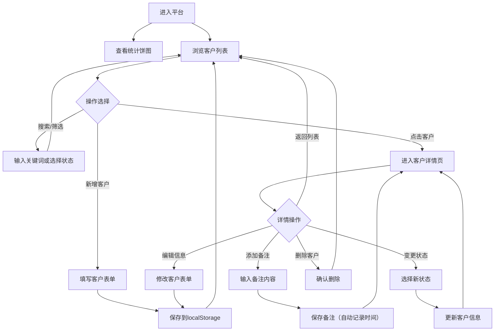

## 1. 产品概述

客户跟进状态管理平台，帮助销售人员系统化管理客户信息与跟进记录。
- 核心用途：录入客户信息、跟踪客户状态、记录跟进历史、数据可视化统计
- 目标用户：销售团队、客户经理、商务人员
- 产品价值：提升客户管理效率，避免客户流失，通过数据驱动销售决策

## 2. 核心功能

### 2.1 功能模块

1. **客户列表页**：数据统计饼图、新增客户按钮、搜索栏、状态筛选、客户卡片列表
2. **客户详情页**：客户基本信息、跟进备注时间线、添加备注表单、状态变更操作
3. **新增/编辑客户弹窗**：客户信息表单（名称、联系人、电话、状态）

### 2.2 页面详情

| 页面名称 | 模块名称 | 功能描述 |
|-----------|-------------|---------------------|
| 客户列表页 | 统计概览区 | 饼图展示各状态客户数量分布，显示总数及各状态数字 |
| 客户列表页 | 工具栏 | 搜索框（按客户名称搜索）、状态筛选标签（全部/待联系/已联系/已报价/已成交/已流失） |
| 客户列表页 | 客户卡片列表 | 展示客户名称、联系人、电话、状态标签，点击进入详情 |
| 客户详情页 | 基本信息区 | 显示客户完整信息、状态变更下拉选择器、编辑/删除按钮 |
| 客户详情页 | 跟进时间线 | 按时间倒序展示跟进备注（时间+内容） |
| 客户详情页 | 添加备注区 | 文本域输入备注内容，保存后自动记录时间 |
| 新增/编辑弹窗 | 表单区 | 客户名称、联系人、电话（必填校验）、状态选择 |

## 3. 核心流程

### 3.1 主流程描述

用户进入平台 → 查看统计概览和客户列表 → 通过搜索/筛选定位客户 → 点击客户查看详情 → 添加跟进备注或变更状态 → 可随时新增客户

### 3.2 流程图

## 4. 用户界面设计

### 4.1 设计风格

- **主色调**：深邃蓝 (#1e3a5f) 作为主色，搭配活力橙 (#ff6b35) 作为强调色
- **辅助色**：各状态对应色 - 待联系(#94a3b8)、已联系(#3b82f6)、已报价(#f59e0b)、已成交(#10b981)、已流失(#ef4444)
- **按钮风格**：圆角胶囊按钮，主色填充，悬停微上浮+阴影加深
- **字体**：标题使用 'Noto Serif SC'（思源宋体）凸显专业感，正文使用 'Noto Sans SC'（思源黑体）确保可读性
- **布局风格**：左侧导航+右侧内容区的经典B端布局，卡片式设计，清晰的信息层级
- **图标风格**：线性图标，统一2px描边，圆润端点

### 4.2 页面设计概述

| 页面名称 | 模块名称 | UI元素描述 |
|-----------|-------------|-------------|
| 客户列表页 | 统计概览区 | 左侧饼图（带动画悬停效果），右侧数字卡片网格，渐变背景 |
| 客户列表页 | 工具栏 | 搜索框（左侧搜索图标，聚焦发光效果），筛选标签（选中态实心+白字） |
| 客户列表页 | 客户卡片 | 白底卡片，状态彩色胶囊标签，hover时微上浮+阴影，过渡动画 |
| 客户详情页 | 基本信息区 | 大标题客户名，信息网格布局，状态下拉选择器，操作按钮组 |
| 客户详情页 | 跟进时间线 | 左侧时间轴竖线，圆点标记，右侧备注卡片（渐变左边框） |
| 客户详情页 | 添加备注区 | 大文本域，字数统计，提交按钮（右侧对齐） |
| 新增弹窗 | 表单区 | 半透明遮罩背景，居中白色弹窗，表单标签+输入框分组，底部按钮组 |

### 4.3 响应式

- **桌面优先**设计，基础适配 1440px 宽度
- **平板适配** (≥768px)：统计区饼图与数字卡上下堆叠，客户卡片两列布局
- **移动端适配** (<768px)：单栏布局，侧边栏收起为汉堡菜单，搜索与筛选换行显示
- 触摸设备优化：按钮最小高度 44px，点击区域充足

### 4.4 动效设计

- 页面加载：统计数据数字滚动动画，客户卡片渐入+上移（stagger延迟）
- 饼图交互：悬停时扇区外移+高亮，显示tooltip
- 状态切换：数字变化时滚动动画，卡片状态标签颜色过渡
- 弹窗：遮罩淡入，弹窗从下方滑入+弹性缓动
