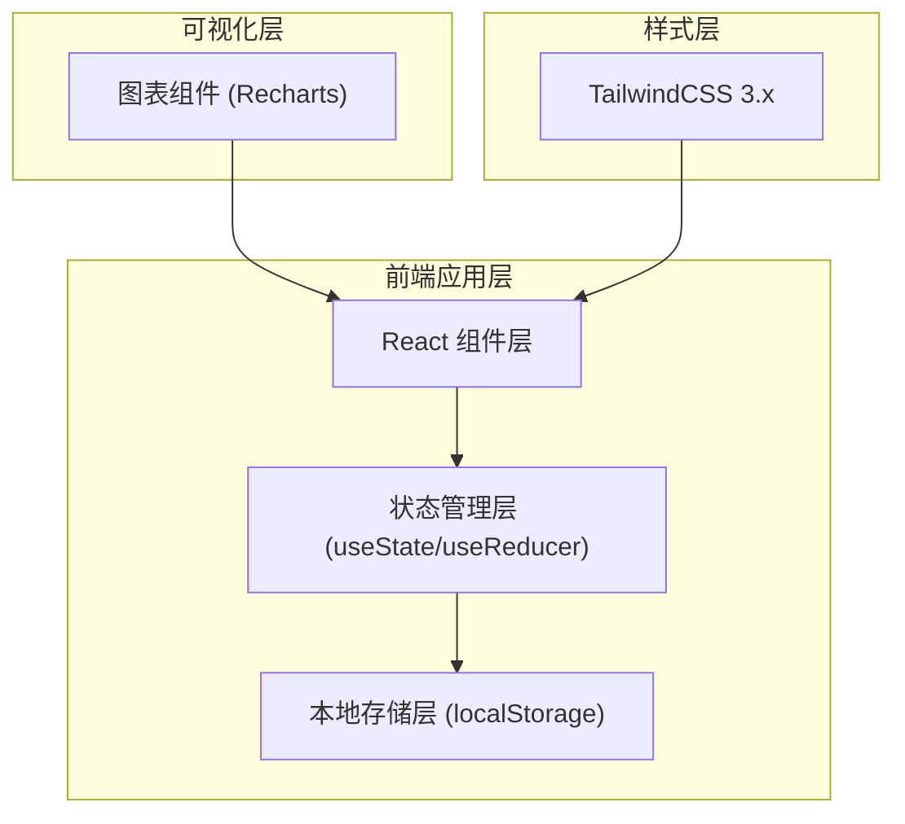
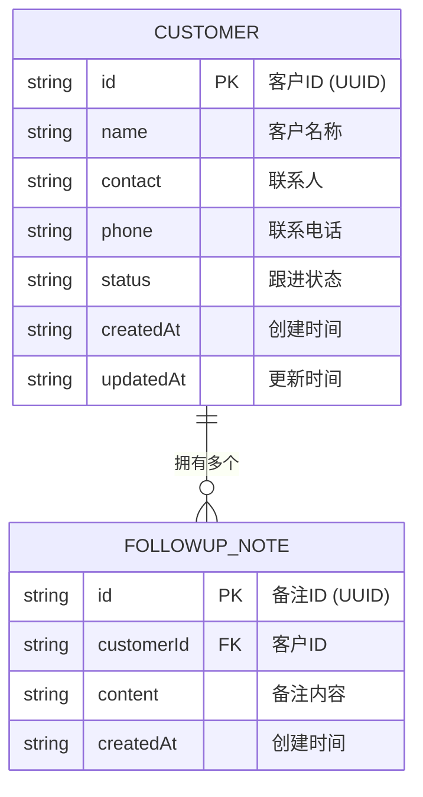

## 1. 架构设计



## 2. 技术说明

- **前端框架**：React@18 + TypeScript
- **构建工具**：Vite@5
- **样式方案**：TailwindCSS@3
- **图表库**：Recharts（React生态轻量级图表库，完美支持饼图）
- **状态管理**：React Hooks（useState + useReducer + Context）
- **路由管理**：React Router DOM@6（用于客户列表与详情页切换）
- **数据存储**：浏览器 localStorage（JSON序列化存储）
- **图标库**：Lucide React（简洁线性图标）
- **字体方案**：Google Fonts CDN（Noto Serif SC + Noto Sans SC）

## 3. 路由定义

| 路由路径 | 页面组件 | 用途说明 |
|-----------|----------|---------|
| `/` | CustomerList | 客户列表首页（统计概览+搜索筛选+客户卡片） |
| `/customer/:id` | CustomerDetail | 客户详情页（信息展示+跟进时间线+添加备注） |

## 4. 数据模型

### 4.1 数据模型定义



### 4.2 数据结构定义（TypeScript）

```typescript
type CustomerStatus = 'pending' | 'contacted' | 'quoted' | 'closed' | 'lost';

interface Customer {
  id: string;
  name: string;
  contact: string;
  phone: string;
  status: CustomerStatus;
  createdAt: string;
  updatedAt: string;
}

interface FollowupNote {
  id: string;
  customerId: string;
  content: string;
  createdAt: string;
}

interface AppData {
  customers: Customer[];
  notes: FollowupNote[];
}
```

### 4.3 状态映射配置

```typescript
const STATUS_CONFIG: Record<CustomerStatus, { label: string; color: string; bgColor: string }> = {
  pending:   { label: '待联系', color: '#94a3b8', bgColor: '#f1f5f9' },
  contacted: { label: '已联系', color: '#3b82f6', bgColor: '#dbeafe' },
  quoted:    { label: '已报价', color: '#f59e0b', bgColor: '#fef3c7' },
  closed:    { label: '已成交', color: '#10b981', bgColor: '#d1fae5' },
  lost:      { label: '已流失', color: '#ef4444', bgColor: '#fee2e2' },
};
```

### 4.4 localStorage 存储键名

```typescript
const STORAGE_KEY = 'customer_management_platform_v1';
```

### 4.5 初始Mock数据（首次加载时填充）

```typescript
const INITIAL_CUSTOMERS: Customer[] = [
  {
    id: '1',
    name: '北京鑫源科技有限公司',
    contact: '张经理',
    phone: '13800138001',
    status: 'contacted',
    createdAt: '2026-06-10T10:30:00',
    updatedAt: '2026-06-15T14:20:00',
  },
  // ... 更多示例数据
];
```

## 5. 核心模块文件结构

```
src/
├── components/
│   ├── layout/
│   │   └── Sidebar.tsx          # 侧边导航栏
│   ├── customer/
│   │   ├── CustomerCard.tsx     # 客户卡片组件
│   │   ├── CustomerForm.tsx     # 新增/编辑表单
│   │   ├── CustomerModal.tsx    # 表单弹窗
│   │   ├── SearchBar.tsx        # 搜索+筛选工具栏
│   │   ├── FollowupTimeline.tsx # 跟进时间线
│   │   └── NoteForm.tsx         # 添加备注表单
│   └── dashboard/
│       ├── StatsPieChart.tsx    # 统计饼图
│       └── StatsCards.tsx       # 状态数字卡片
├── pages/
│   ├── CustomerList.tsx         # 客户列表页
│   └── CustomerDetail.tsx       # 客户详情页
├── hooks/
│   └── useLocalStorage.ts       # localStorage Hook
├── context/
│   └── CustomerContext.tsx      # 全局客户数据Context
├── types/
│   └── index.ts                 # TypeScript类型定义
├── utils/
│   └── helpers.ts               # 工具函数（格式化、UUID等）
├── config/
│   └── statusConfig.ts          # 状态配置常量
├── App.tsx
├── main.tsx
└── index.css
```

## 6. 性能与体验优化

- 使用 React.memo 优化客户卡片渲染性能
- 搜索筛选使用 useMemo 缓存计算结果
- localStorage 读写防抖处理（避免频繁IO）
- 图片/字体资源合理使用 CDN 预加载
- 表单提交使用乐观更新提升响应速度
- 路由切换时使用 Suspense + loading 骨架屏
